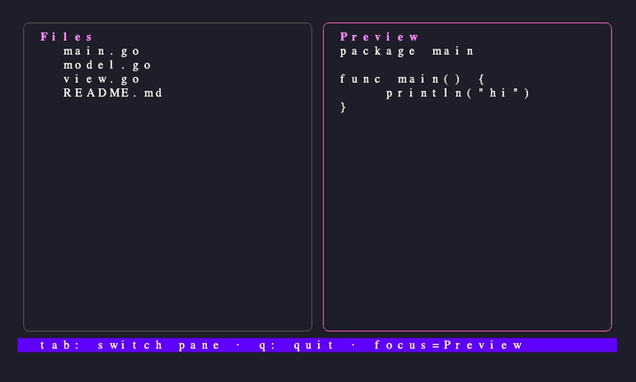

# tea-eyes

> Visual feedback for TUI development with Claude Code.
> *Playwright for terminals.*

**Status:** beta — v0.1.0



## What it is

- **An MCP server** that lets Claude Code *see* a terminal user interface
  three ways: text capture, true-pixel image, or in-process Bubble Tea
  model state.
- **Two reference subagents** (`tui-designer`, `tui-tester`) that bake
  the render → look → edit → re-render loop into focused workflows.
- **Two companion skills** (`tea-eyes-loop`, `tea-eyes-bubbletea`) that
  teach Claude when to reach for which tool.

Closes the visual feedback gap that has historically made TUI development
with Claude Code feel blind compared to web development with Playwright.

## Install

### macOS / Linux / Windows — release binary

Download a release artifact from the
[Releases page](https://gitlab.com/skjutare/tea-eyes/-/releases), extract,
and put `tea-eyes` on `PATH`. The archive bundles `plugin/`, `LICENSE`,
`NOTICE`, and the changelog.

### From source (any platform)

```sh
go install gitlab.com/skjutare/tea-eyes/cmd/tea-eyes@latest
```

Requires Go 1.26+.

### External dependencies

`tui_render_image` shells out to [VHS](https://github.com/charmbracelet/vhs),
which itself needs `ttyd` and `ffmpeg`. `tmux` is optional.

```sh
brew install vhs ttyd ffmpeg tmux
# Linux / Windows: see https://github.com/charmbracelet/vhs#installation
```

Verify with `tea-eyes doctor`.

### Register with Claude Code

As an MCP server:

```sh
claude mcp add tea-eyes -- tea-eyes serve
```

As a full plugin (gets you the skills and subagents too):

```sh
claude plugin install gitlab.com/skjutare/tea-eyes
```

## Quickstart (5 minutes)

```sh
git clone https://gitlab.com/skjutare/tea-eyes && cd tea-eyes
make build
go build -o ./bin/hello-tui  ./examples/hello-tui
go build -o ./bin/multi-pane ./examples/multi-pane
tea-eyes doctor
```

Open Claude Code in this directory and ask:

> *Render `./bin/multi-pane` as a PNG and tell me how to balance the two
> columns.*

Claude calls `tui_render_image`, sees the actual image, and can reason
about color, borders, and spacing.

For the full walkthrough — design loop, golden tests, watching the agent
in tmux, composing with GGPrompts — see
[`docs/workflow.md`](docs/workflow.md).

## Subagents

| Agent | When to invoke | Example prompt |
|-------|----------------|----------------|
| [`tui-designer`](plugin/agents/tui-designer.md) | Visual design: layout, spacing, borders, colors, focus | *"Tweak the focus color of the right panel to be more vibrant."* |
| [`tui-tester`](plugin/agents/tui-tester.md) | Golden-file testing of Bubble Tea TUIs | *"Add a golden test for the current state after pressing space."* |

The agents are intentionally narrow. There is **no** general-purpose
"tui-engineer" agent — that role belongs to Claude Code itself, with the
skills loaded. See [`docs/agents.md`](docs/agents.md) for the full
contract, the tool lists, and how the agents compose with the skills.

## Skills

| Skill | Scope | Note |
|-------|-------|------|
| [`tea-eyes-loop`](plugin/skills/tea-eyes-loop/SKILL.md) | Framework-agnostic | Teaches the visual feedback loop and which MCP tool to use when |
| [`tea-eyes-bubbletea`](plugin/skills/tea-eyes-bubbletea/SKILL.md) | Bubble Tea specific | White-box pattern, color-profile discipline; **additive to GGPrompts/TFE** |

`tea-eyes-bubbletea` defers all layout rules to the GGPrompts/TFE
bubbletea skill — install both for the full design loop. See
[`docs/compat-ggprompts.md`](docs/compat-ggprompts.md).

## MCP tools

| Tool | Purpose |
|------|---------|
| `tui_capture_text` | Spawn any TUI under pty (or tmux), optionally send keys, return rendered text grid |
| `tui_render_image` | Render any TUI as PNG/GIF via VHS, returned as an MCP image content block |
| `tui_test_golden` | Drive a Bubble Tea model in-process via teatest, compare against a golden file |
| `tui_inspect_model` | Drive a Bubble Tea model, return JSON-encoded exported fields plus `View()` |
| `tui_session_attach_hint` | Return the `tmux attach` command for a persistent capture session |

Full reference: [`docs/mcp-tools.md`](docs/mcp-tools.md).

## Status / Roadmap

- [x] Phase 0 — Bootstrap
- [x] Phase 1 — MCP server + pty + `tui_capture_text`
- [x] Phase 2 — VHS image rendering + `tui_render_image`
- [x] Phase 3 — teatest harness + `tui_test_golden` + `tui_inspect_model`
- [x] Phase 4 — Skills + plugin manifest
- [x] Phase 5 — Reference subagents (`tui-designer`, `tui-tester`)
- [x] Phase 6 — tmux driver + `mode` parameter
- [x] Phase 7 — Release polish + v0.1.0

Post-v0.1.0 roadmap: [`docs/roadmap.md`](docs/roadmap.md). Full master
plan: [`docs/plan.md`](docs/plan.md).

## Prior art and credits

tea-eyes stands on a lot of shoulders. Explicit credits:

- [Charm](https://charm.sh) — Bubble Tea, Lipgloss, Bubbles, VHS, teatest
- [mark3labs/mcp-go](https://github.com/mark3labs/mcp-go) — Go MCP framework
- GGPrompts / TFE bubbletea Claude Code skill — layout rules tea-eyes defers to
- [jmlago "Debug TUIs with tmux"](https://github.com/jmlago) skill — the original tmux pattern
- rigerc/bubbletea-v2-scaffold — project-shaped companion to this plugin-shaped tool
- Hatchet — "Building a TUI is easy now" post that validated the workflow

See [`NOTICE`](NOTICE) for the full attribution.

## License

MIT. See [`LICENSE`](LICENSE) and [`NOTICE`](NOTICE).
